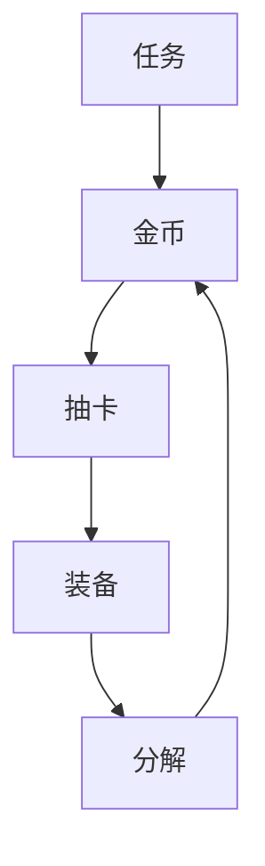

# 《冒险者》超时空抽卡商店系统说明

  
*"每一次抽卡都是穿越时空的冒险"*

## 目录
- [系统概述](#系统概述)
- [武器生成规则](#武器生成规则)
- [抽卡机制](#抽卡机制)
- [经济系统](#经济系统)
- [特殊规则](#特殊规则)
- [界面说明](#界面说明)
- [平衡性设计](#平衡性设计)
- [FAQ](#faq)

## 系统概述
本系统将原"超时空商店"改造为抽卡式装备获取系统，保留完整的随机武器生成逻辑，包含：
- 7级品质体系（白→红）
- 10种武器类型
- 动态属性计算
- 词缀系统

## 武器生成规则
### 品质参数
| 品质 | 颜色 | 攻击系数 | 词缀数 | 分解价值 |
|------|------|---------|-------|---------|
| 白   | 白色 | 0.8-1.0 | 0     | 5金     |
| ...  | ...  | ...     | ...   | ...     |
| 红   | 红色 | 4.0-5.0 | 3     | 不可分解 |

### 属性计算公式
```
最终攻击力 = 
    rand(1,350) × 品质系数 × 前缀系数
```

## 抽卡机制
### 基础规则
- 单抽：100金币
- 十连：550金币（省45%）
- 保底：
  - 每20抽必出紫+
  - 每100抽必出橙+

### 概率分布
```python
概率表 = {
    "白":45%, "绿":25%, "蓝":15%,
    "紫":8%, "橙":5%, "金":1.5%, "红":0.5%
}
```

## 经济系统
### 金币循环


### 收益参考
| 活动类型 | 金币奖励 | 等效抽卡 |
|---------|--------|---------|
| 主线任务 | 300-500 | 3-5抽   |
| BOSS战  | 1500   | 15抽    |

## 特殊规则
1. **新手保护**：
   - 前10抽必出紫装
   - 前3次十连橙率+5%

2. **午夜狂欢**：
   - 23:00-01:00抽卡消耗-20%

3. **非酋补偿**：
   ```javascript
   if(连续50抽未出橙){
       概率 += (连续抽数-50)*0.5%
   }
   ```

## 界面说明

1. 抽卡按钮组
2. 保底进度条
3. 装备对比面板
4. 快速操作区

## 平衡性设计
| 目标   | 平均耗时 | 抽数需求 |
|-------|--------|---------|
| 全紫  | 6小时  | 60抽    |
| 1橙   | 8小时  | 80抽    |
| 1红   | 100小时| 1000抽  |

## FAQ
❓Q：能否通过SL刷装备？  
✅A：抽卡结果采用种子预生成，读档不会改变结果

❓Q：十连比单抽优惠多少？  
✅A：十连单价55金/抽，相当于45%折扣

❓Q：红装是否可交易？  
✅A：纯单机游戏，装备仅限本地使用

---
`版本 1.0 | 最后更新 2025-4-20`
``` 